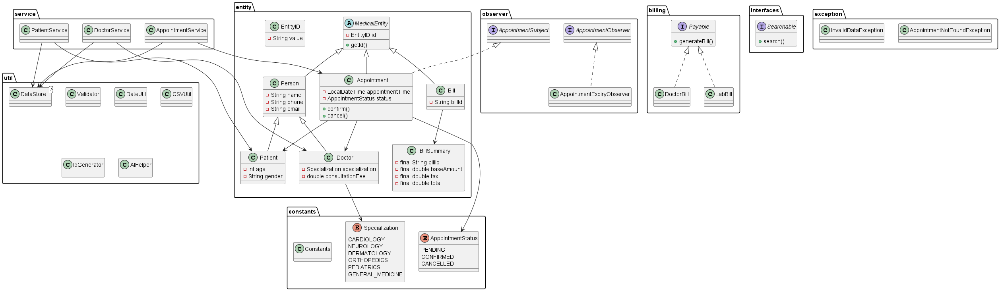

# MediTrack -- Clinic & Appointment Management System

## Overview

**MediTrack** is a Java-based console application designed to manage a
clinic's patients, doctors, appointments, and billing operations.

The project demonstrates core and advanced Java concepts including: -
Object-Oriented Programming (OOP) - Design Patterns - Collections and
Generics - Exception Handling - File I/O and CSV persistence - Java
Streams and Lambdas - Concurrency basics - Menu-driven console UI

------------------------------------------------------------------------

## Project Structure

    com.airtribe.meditrack
    │
    ├── entity
    │   ├── MedicalEntity
    │   ├── Person
    │   ├── Doctor
    │   ├── Patient
    │   ├── Appointment
    │   ├── Bill
    │   ├── BillSummary
    │   └── id/EntityID
    │
    ├── entity.bill
    │   ├── DoctorBill
    │   └── LabBill
    │
    ├── service
    │   ├── DoctorService
    │   ├── PatientService
    │   └── AppointmentService
    │
    ├── util
    │   ├── Validator
    │   ├── DateUtil
    │   ├── CSVUtil
    │   ├── IdGenerator
    │   ├── AIHelper
    │   └── DataStore<T>
    │
    ├── constants
    │   ├── Constants
    │   ├── Specialization
    │   └── AppointmentStatus
    │
    ├── interfaces
    │   ├── Payable
    │   └── Searchable
    │
    ├── observer
    │   ├── AppointmentObserver
    │   ├── AppointmentSubject
    │   └── AppointmentExpiryObserver
    │
    ├── exception
    │   ├── AppointmentNotFoundException
    │   └── InvalidDataException
    │
    ├── test
    │   └── TestRunner
    │
    └── Main.java

------------------------------------------------------------------------

## Environment Setup & JVM Understanding

Documentation included in:

    docs/
     ├── Setup_Instructions.md
     └── JVM_Report.md

The JVM report explains: - Class Loader mechanism - Runtime Data Areas
(Heap, Stack, Method Area, PC Register) - Execution Engine - Interpreter
vs JIT Compiler - Java's **Write Once, Run Anywhere** concept
------------------------------------------------------------------------

## Project Structure

------------------------------------------------------------------------

## Java Basics Demonstrated

### Access Modifiers

Used throughout entities and services with private fields and public
getters/setters.

### Variable Scope

Demonstrated using: - static variables - instance variables - static
initialization blocks

Example classes: - `Constants` - `IdGenerator`

### Primitive Types and Casting

Used in: - fee calculations - CSV parsing - date conversions

------------------------------------------------------------------------

## Core OOP Implementation

### Encapsulation

All entities maintain **private fields** with controlled access via
getters/setters. Validation logic is centralized in:

    Validator

### Inheritance

    MedicalEntity
         │
        Person
       /      \
    Doctor   Patient

Constructors use `super()` and constructor chaining.

### Polymorphism

#### Method Overloading

    searchPatient(id)
    searchPatient(name)
    searchPatient(age)

#### Method Overriding

Billing logic overridden in:

    DoctorBill
    LabBill

#### Dynamic Dispatch

    Payable bill = new DoctorBill(...)
    bill.generateBill()

------------------------------------------------------------------------

## Abstraction & Interfaces

### Abstract Class

    MedicalEntity

Provides shared functionality for entities.

### Interfaces

#### Payable

Implemented by:

    DoctorBill
    LabBill

#### Searchable

Implemented by services to support dynamic search.

------------------------------------------------------------------------

## Advanced OOP Features

### Deep vs Shallow Copy

`Cloneable` implemented for:

    Patient
    Appointment

### Immutable Class

    BillSummary

Features: - final class - final fields - no setters - thread-safe

### Enums

#### Specialization

    CARDIOLOGY
    NEUROLOGY
    DERMATOLOGY
    ORTHOPEDICS
    PEDIATRICS
    GENERAL_MEDICINE

#### AppointmentStatus

    PENDING
    CONFIRMED
    CANCELLED

------------------------------------------------------------------------

## Application Logic

### CRUD Operations

#### Patients

Managed by `PatientService`.

#### Doctors

Managed by `DoctorService`.

### Appointment Management

Handled by `AppointmentService`.

Features: - create appointment - view appointment - cancel appointment

Uses `AppointmentStatus` enum.

------------------------------------------------------------------------

## Billing System

Billing classes:

    Bill
    DoctorBill
    LabBill
    BillSummary

Tax calculated using:

    Constants.TAX_RATE

------------------------------------------------------------------------

## Design Patterns Implemented

### Singleton Pattern

Used in:

    IdGenerator

### Strategy Pattern

Billing strategies implemented for flexible bill calculations.

### Observer Pattern

Used for appointment expiry notifications.

Appointment slots are reserved and automatically cancelled if not
confirmed within the configured duration.

------------------------------------------------------------------------

## File I/O & Persistence

CSV persistence implemented via:

    CSVUtil

Supports:

-   reading CSV files
-   writing CSV files
-   try-with-resources
-   `String.split(",")` parsing

Files used:

    patients.csv
    doctors.csv
    appointments.csv

------------------------------------------------------------------------

## AI Feature

Implemented in:

    AIHelper

Capabilities: - rule-based doctor recommendation - symptom →
specialization mapping - appointment slot suggestions

Example:

    "chest pain" → CARDIOLOGY

------------------------------------------------------------------------

## Streams & Lambdas

Used for analytics including:

-   filtering doctors by specialization
-   computing average consultation fee
-   appointment analytics per doctor

Example operations:

    filter()
    mapToDouble()
    groupingBy()
    counting()

------------------------------------------------------------------------

## Collections Used

The project uses:

    ArrayList
    HashMap

Generic repository pattern implemented using:

    DataStore<T>

------------------------------------------------------------------------

## Exception Handling

Custom exceptions:

    AppointmentNotFoundException
    InvalidDataException

Features demonstrated: - try/catch - custom exceptions -
try-with-resources

------------------------------------------------------------------------

## Console UI

Implemented in:

    Main.java

Features: - menu-driven interface - CRUD operations - appointment
scheduling - search functionality - billing

------------------------------------------------------------------------

## Testing

Manual testing implemented in:

    test/TestRunner

------------------------------------------------------------------------

## Running the Application

Compile:

    mvn clean compile

Run:

    java com.airtribe.meditrack.Main

Load persisted data:

    java com.airtribe.meditrack.Main --loadData

------------------------------------------------------------------------

## Conclusion

MediTrack demonstrates practical implementation of:

-   Java OOP principles
-   Design patterns
-   File persistence
-   Streams and analytics
-   Console-based application architecture

