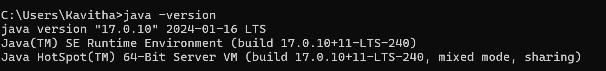
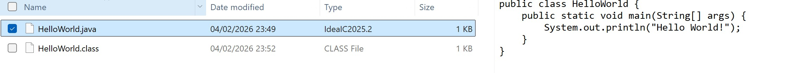
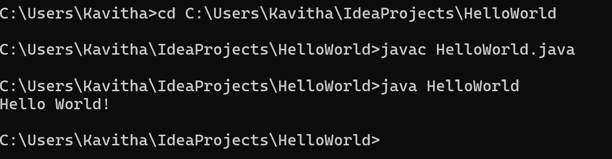

# Setup Instructions

### JDK Version Used

- Java Development Kit (JDK): JDK 17  

The installed JDK version :
```
java -version
```

---

### Running a Hello World Program

#### 1: Created a file named `HelloWorld.java` with the following content:

```java
public class HelloWorld {
    public static void main(String[] args) {
        System.out.println("Hello World!");
    }
}
```

#### 2: Compile the Program

Open a terminal in the directory containing the file and run:

```
javac HelloWorld.java
```

This generates a `HelloWorld.class` file.


#### 3: Run the Program

```
java HelloWorld
```

##### Output

```
Hello World!
```

The Java environment is set up correctly and programs can be compiled and executed successfully.
